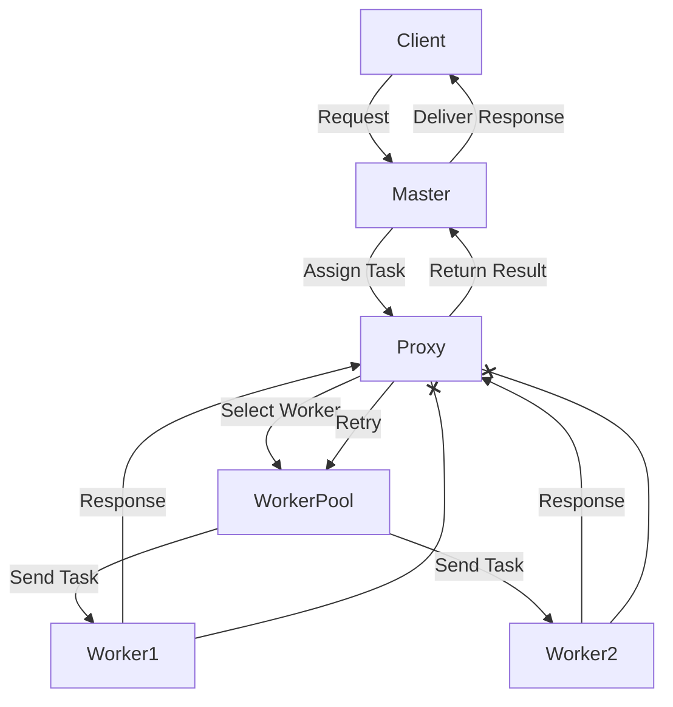

# Fault-Tolerant-Distributed-System
A distributed system designed with fault tolerance mechanisms, built using Elixir. Implements strategies to handle crash, omission, timing, and response failures within a master-worker architecture. Includes a bully algorithm for leader election and QoS constraints enforcement.

## Solution Overview
This project implements a fault-tolerant distributed processing system using Elixir. The system consists of a Master, a Pool of Workers, and a Proxy, ensuring reliable task execution while handling failures efficiently.

## How It Works
1. A Client sends a request to the Master.
2. The Master selects an available Worker from the Worker Pool and forwards the request to the Proxy.
3. The Proxy sends the request to the Worker and spawns a dedicated thread to monitor the execution.
4. If a failure occurs, the system applies different strategies to recover:
    - Worker Crash: The failure is detected via Node.monitor, and the request is reassigned to another Worker.
    - Invalid Response: The request is retried on the same Worker.
    - Message Loss/Timeout: If no response is received within 3 seconds, the request is retried up to 3 times. If it still fails, it is reassigned to another Worker.
5. Once a Worker successfully completes the task, the response is sent back to the Client.

This architecture ensures fault tolerance, scalability, and robustness by dynamically handling failures and redistributing tasks as needed.
